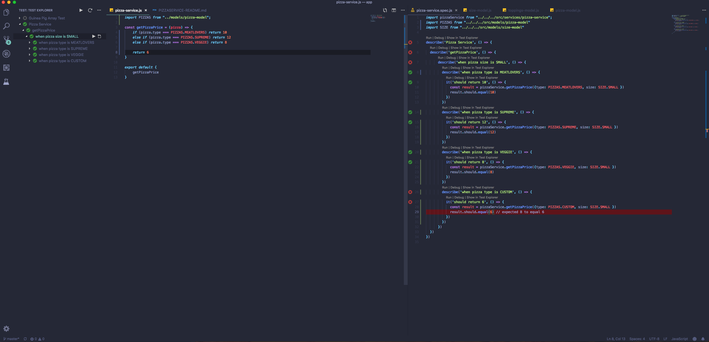
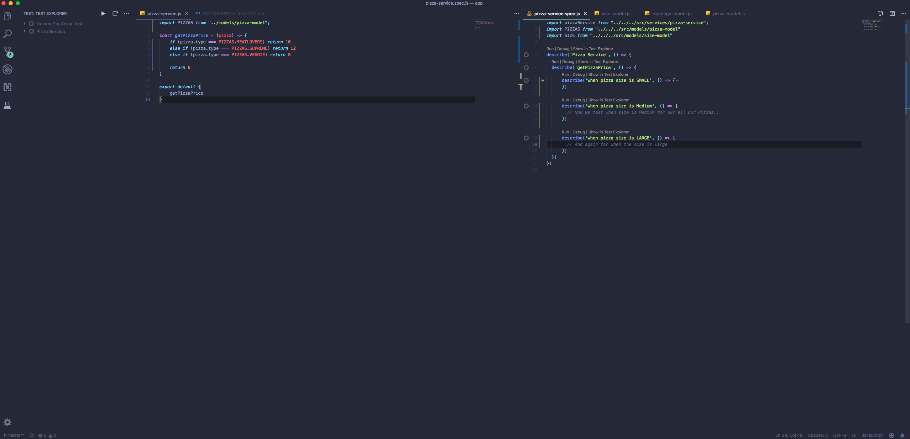
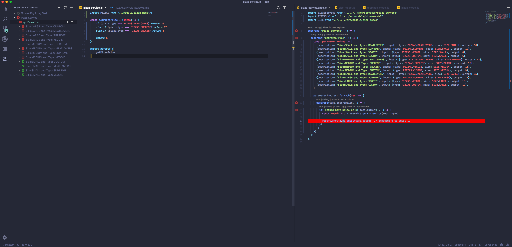
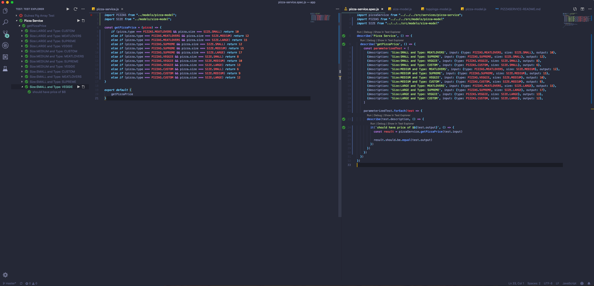
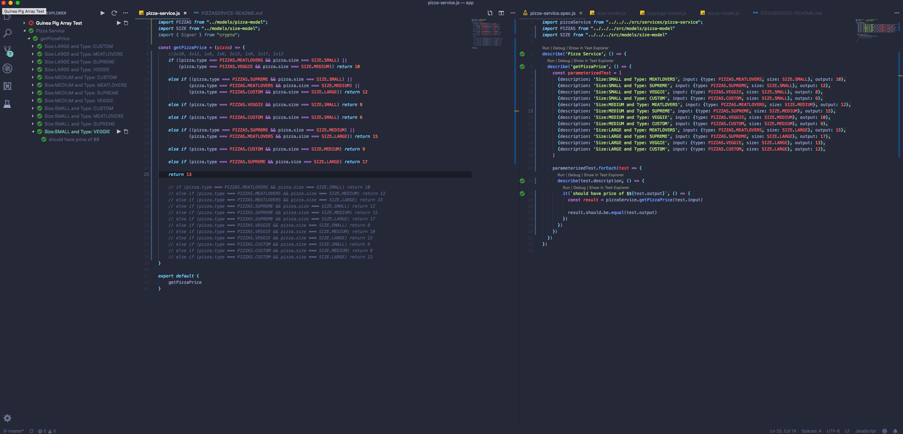
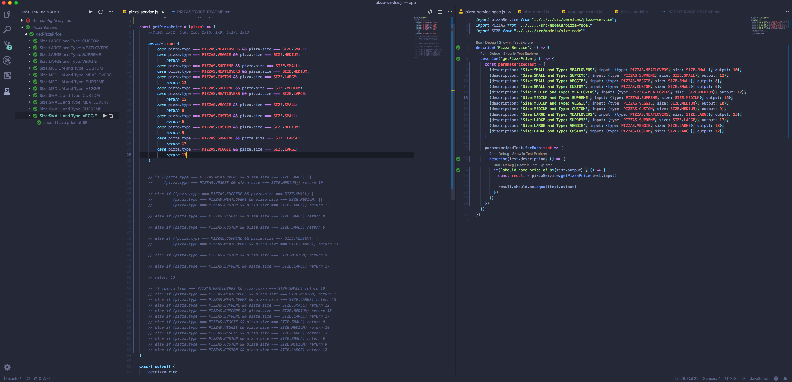
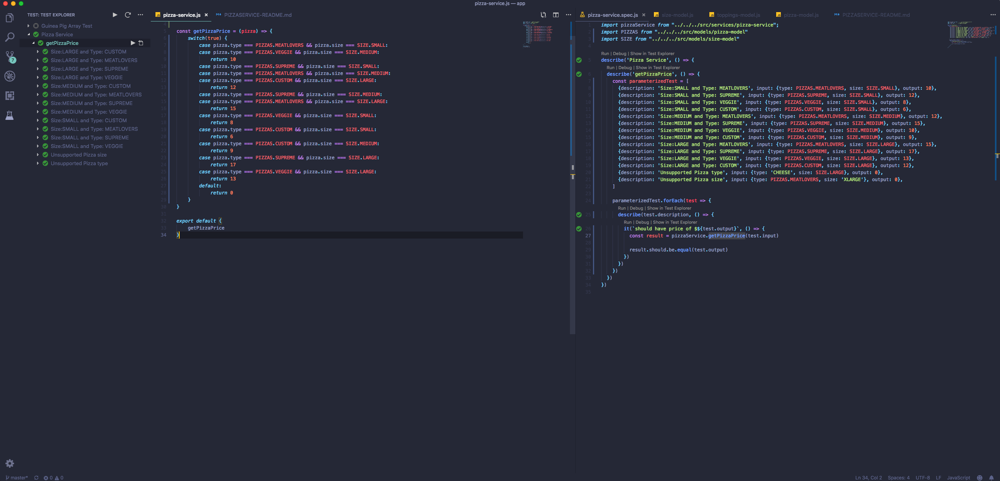
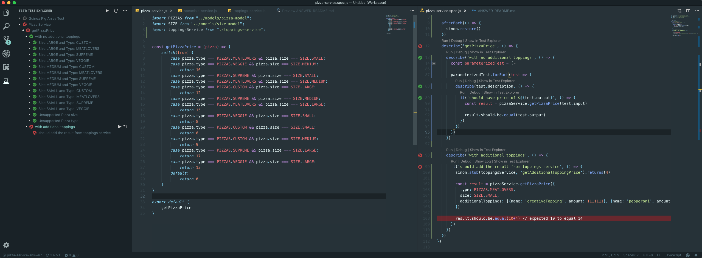
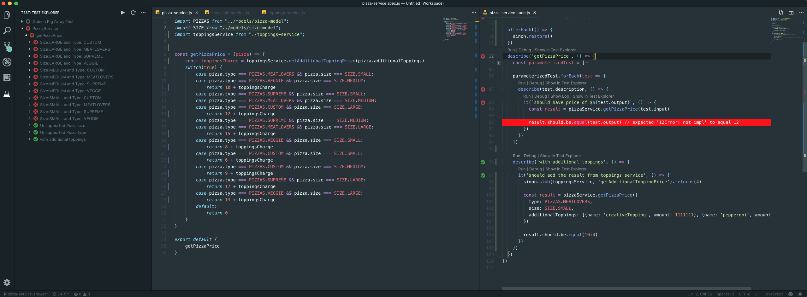
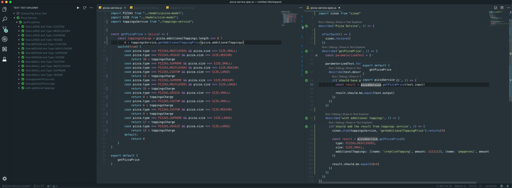

# PIZZA SERVICE LESSON

## Criteria

Business wants the system to have the capability to calculate the price for the Pizza they provide

Should calculate base off of..

1. Pizza Size
2. Pizza Type
3. Additional Toppings

## Price Table

|        | MEATLOVERS | SUPREME | VEGGIE | CUSTOM |
|--------|------------|---------|--------|--------|
| SMALL  | 10         | 12      | 8      | 6      |
| MEDIUM | 12         | 15      | 10     | 9      |
| LARGE  | 15         | 17      | 13     | 12     |

## Objective

**System has a getPizzaPrice(pizza) method that should return a price amount in the file `services/pizza-service`**

**Write the tests that covers all the Buisness Needs (Criteria)**

*NOTE*

1. Pizza object is defined as `{type: 'string', size: 'string', additionalToppings: [...{name: string, amount: number}]'}`
2. System will utilized the `toppings-service` to get the sum of extra toppings and add that to our result


## Learn

1. Mocha BDD style `describe`, `context`, `it` blocks
2. Testing hooks `before`, `beforeEach`, `after`, `afterEach`
3. Parameterized Testing
4. Mocking / Stubbing using sinon

</br>
</br>
</br>
</br>
</br>
</br>
</br>
</br>
</br>
</br>
</br>
</br>
</br>
</br>
</br>
</br>
</br>
</br>
</br>
</br>


# TDD PROGRESSION

## First few test and a simple implmentation



## Adding additional business criteria into our test



## Test Suite becomes huge with additional business logic

**Notice how our structure is similar in every test**

**Lets paramaterized our test to reduce redundant test specs**


## After finishing our implementation. NOTE all of our tests are GREEN



## How can we optimize our solution further?

**Notice a couple of Pizza combination have the same price**

**We can shorten the number of return values by combining these pizza combination that have the same amount**

**Notice after our refactor the tests are still valid**


## Now our solution is optimized but it becomes somewhat unreadable

**Lets refactor one more time**

**Notice our test is still Green after the refactor.  Our small method still behaves the same**


```
Thought Bubble:
Alright everything looks good... Or does it
What other edge cases can you think of?
```

.

.

.

.

.

.

.

.

.

.

.

.

.

.

.

.

.

.

.

.

.

.

.

.

.

.

.

.

.

.

.

.

.

.

.

.

.

.

.

.

.

.

**What happens if we are given a Pizza the Business don't support?**
**Let's cover this with additional test!**


## Alright now we will try to integrate our toppings service to get the surcharge for additional requested toppings

**Note that we have not yet implemented our `toppings-service.js` file**

```
We need to mock out this component in our system so that we are only testing pizza-service unit of work
Mocking / Stubbing is an extremely important concept in TDD
This is what encapsulate our pizza-service from the rest of the system
As our system change, the specific behaviour of pizza-service component should not be affected
```

**We have a failing test after adding the mocked call**



## After implementation and hooking up the toppings service to get our toppings charge we got our new test to pass but our old ones failed


```
Thought Bubble:
What can we do here?
```
.

.

.

.

.

.

.

.

.

.

.

.

.

.

.

.

.

.

.
## Sure we can add our mocked call to our previous tests

.

.

.

.

.

.

.

.

.

.

.

.

.

## But the system is trying to tell us something.  This is where TDD helps with efficiency and simplyfing solutions

## Maybe it makes more sense to only utilize that service when we have additional toppings to charge


## We refactored our implementation without having to update old tests

## Our pizza-service component is more efficient in that it isn't utilizing unnecessary resource and compute time through the toppings-service

## GOTO: [NEW LESSON](../toppings-service/TOPPINGSSERVICE-README.md)